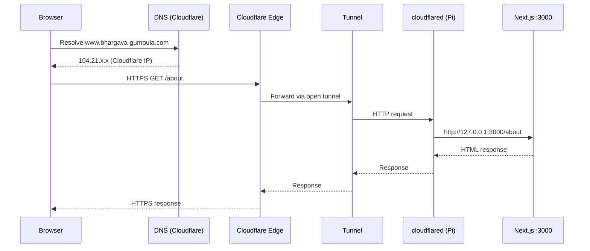
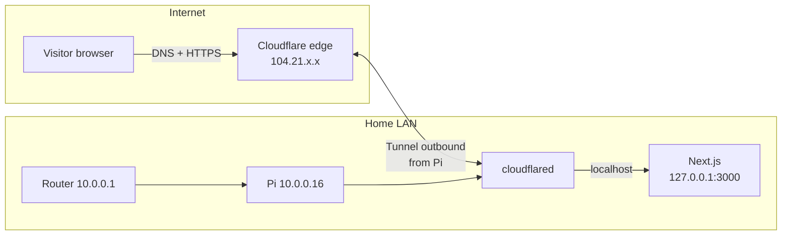

# Networking Design & Traffic Flow

How traffic reaches this website from a browser to the Raspberry Pi, including DNS, IPs, the home router, and Cloudflare Tunnel.

**Live site:** https://www.bhargava-gumpula.com  
**Pi project path:** `~/Work/Website`  
**Pi SSH (local network):** `bhargavagumpula@10.0.0.16` (IP may change via DHCP)

---

## Architecture overview

This site does **not** use traditional `/var/www` + Apache/nginx with port forwarding.

| Layer | Technology |
|-------|------------|
| App | Next.js 16 (Node.js) |
| Process manager | pm2 (`npm start` → port 3000) |
| Public access | Cloudflare Tunnel (`cloudflared`) |
| DNS & HTTPS | Cloudflare (edge) |
| Hosting hardware | Raspberry Pi on home LAN |

```text
Browser  →  DNS  →  Cloudflare edge (public IP)  →  Tunnel  →  Pi (private IP)  →  Next.js :3000
```

---

## Key addresses (vocabulary)

| Name | Example | Scope | Role |
|------|---------|-------|------|
| Domain | `bhargava-gumpula.com` | Global | Human-readable name you own |
| Hostname | `www.bhargava-gumpula.com` | Global | DNS record for the site |
| Cloudflare edge IP | `104.21.x.x`, `2606:4700:...` | Public | Where browsers connect (HTTPS) |
| Home public IP | e.g. `73.203.45.67` | Public | ISP address of your router; used for **outbound** tunnel traffic only |
| Router (gateway) | `10.0.0.1` | Private (LAN) | DHCP, NAT, local DNS |
| Raspberry Pi | `10.0.0.16` | Private (LAN) | May change; was `192.168.7.34` / `192.168.4.37` on other networks |
| Loopback | `127.0.0.1` / `localhost` | Pi only | Next.js listens here on port 3000 |

**Private IPs** (`10.x`, `192.168.x`) are not reachable from the public internet.  
**The Pi’s LAN IP is never published in DNS for the website.**

---

## Why not `/var/www`?

Traditional hosting:

```text
Browser → Apache/nginx → reads files from /var/www/html
```

This project:

```text
Browser → Cloudflare → Tunnel → Node.js (Next.js) serves from ~/Work/Website
```

Next.js **is** the web server. It runs as a process on **port 3000**, not as files served by Apache from `/var/www`.

---

## What is a Cloudflare Tunnel?

A **tunnel** is a **persistent, encrypted, outbound connection** from the Pi to Cloudflare.

- The Pi **calls out** to Cloudflare (`cloudflared` starts the connection).
- Visitors **never** connect directly to `10.0.0.16`.
- **No port forwarding** on the home router for 80/443 is required.
- DNS points to **Cloudflare**, not your home public IP.

### Analogy

The Pi keeps a **phone call open** to Cloudflare 24/7. When someone visits your site, Cloudflare **relays** the request through that call to the Pi.

### Tunnel vs port forwarding

**Port forwarding (not used):**

```text
Internet user ──► Home public IP:443 ──► Router NAT ──► Pi 10.0.0.16:3000
                  (INBOUND — must open router ports)
```

**Cloudflare Tunnel (used):**

```text
Pi 10.0.0.16 ──► Router ──► ISP ──► Cloudflare     (OUTBOUND — Pi initiates)
Internet user ──► Cloudflare only                  (INBOUND to Cloudflare edge)
Cloudflare ──► existing tunnel ──► Pi cloudflared ──► localhost:3000
```

---

## Full stack diagram

```text
                         PUBLIC INTERNET
                                │
          Visitor                 │
        203.0.113.50              │
             │                    │
             │  ① DNS lookup
             │     www.bhargava-gumpula.com
             │     → CNAME → xxxx.cfargotunnel.com
             │     → A/AAAA → 104.21.55.12 (Cloudflare)
             │                    │
             │  ② HTTPS GET /     │
             │     TO 104.21.55.12:443
             ▼                    ▼
        ┌─────────────────────────────────┐
        │      Cloudflare Edge (PoP)        │
        │      104.21.55.12 (example)       │
        │      TLS terminates here          │
        └──────────────┬──────────────────────┘
                       │
                       │  ③ Through TUNNEL
                       │     (encrypted pipe opened by Pi)
                       │
        ┌──────────────▼──────────────────────────────────────┐
        │  YOUR HOME NETWORK (10.0.0.0/24)                     │
        │                                                      │
        │   ┌─────────────────┐                              │
        │   │ Router 10.0.0.1 │  NAT / DHCP                    │
        │   │ Public: 73.x.x.x│  (home ISP address)            │
        │   └────────┬────────┘                              │
        │            │                                       │
        │   ┌────────▼────────┐    ┌──────────────────┐     │
        │   │ Pi 10.0.0.16    │    │ Your Mac         │     │
        │   │                 │    │ 10.0.0.x         │     │
        │   │ cloudflared ◄───┼────┤ SSH admin only   │     │
        │   │      │          │    └──────────────────┘     │
        │   │      ▼          │                              │
        │   │ 127.0.0.1:3000  │                              │
        │   │ Next.js (pm2)   │                              │
        │   │ ~/Work/Website  │                              │
        │   └─────────────────┘                              │
        └──────────────────────────────────────────────────────┘
```

---

## Phase A — Tunnel establishment (boot / cloudflared start)

Happens when `cloudflared` starts (systemd service after install from Cloudflare dashboard).

```text
1. cloudflared on Pi (10.0.0.16) starts

2. Outbound packet:
   FROM  10.0.0.16:54321        (Pi, random high port)
   VIA   10.0.0.1               (router gateway)
   NAT   → 73.203.45.67:54321   (home public IP)
   TO    104.21.55.12:7844      (Cloudflare, example port)

3. TLS + tunnel credentials (token from dashboard install command)

4. Connection stays open = the tunnel
```

Router performs **NAT** (Network Address Translation):

```text
LAN:     10.0.0.16:54321  ↔  WAN: 73.203.45.67:54321
```

Outbound connections are allowed by default. **No inbound port-forward rule needed.**

---

## Phase B — Visitor requests a page (e.g. GET /about)

### Step 1 — DNS resolution

Browser / OS resolver asks (via ISP or router DNS):

```text
"What is the IP for www.bhargava-gumpula.com?"
```

Lookup chain (simplified):

```text
Browser
  → Resolver (e.g. 10.0.0.1 or 8.8.8.8)
    → Root → .com TLD
      → Cloudflare authoritative DNS (domain uses Cloudflare nameservers)
```

Typical answer for a tunneled hostname:

```text
www.bhargava-gumpula.com  CNAME  abc123.cfargotunnel.com
abc123.cfargotunnel.com   A      104.21.55.12
                          AAAA   2606:4700:...
```

Browser will connect to **Cloudflare’s IP**, not `10.0.0.16`.

---

### Step 2 — Browser → Cloudflare (HTTPS)

```text
Source:      Visitor 203.0.113.50:61234
Destination: 104.21.55.12:443
Host header: www.bhargava-gumpula.com
Request:     GET /about HTTP/2
TLS SNI:     www.bhargava-gumpula.com
```

HTTPS certificate is served by **Cloudflare** for your domain.

Path on the internet:

```text
Visitor → ISP → many core routers → nearest Cloudflare data center
```

Your home router is **not** in this path unless the visitor is on your home Wi‑Fi.

---

### Step 3 — Cloudflare → tunnel → Pi

Cloudflare maps:

```text
Hostname www.bhargava-gumpula.com
  → Tunnel "website-pi"
  → Active connector (cloudflared on your Pi)
```

HTTP request is sent **inside the existing tunnel** (not as a new public packet to your home IP):

```text
(encrypted inside tunnel)

cloudflared on Pi receives:
  GET /about HTTP/1.1
  Host: www.bhargava-gumpula.com
  (+ Cloudflare proxy headers)
```

---

### Step 4 — cloudflared → Next.js (loopback on Pi)

Tunnel route configured in Cloudflare dashboard:

```text
Public hostname: www.bhargava-gumpula.com
Service type:    HTTP
URL:             localhost:3000
```

On the Pi:

```text
cloudflared (10.0.0.16)
    │
    │  HTTP to 127.0.0.1:3000
    ▼
Next.js (pm2: npm start)
    │
    │  Renders /about from ~/Work/Website (.next build)
    ▼
HTML / JSON / assets
```

| Hop | Address | Notes |
|-----|---------|-------|
| Tunnel target | `127.0.0.1:3000` | Loopback — same machine only |
| App files | `~/Work/Website` | Source + `.next` build output |

---

### Step 5 — Response (reverse path)

```text
Next.js → cloudflared → Cloudflare edge → Visitor browser
```

---

## Contact form (POST /api/contact)

Same path as page loads, with a **POST** instead of **GET**:

```text
Browser POST /api/contact
  → Cloudflare (104.21.x.x)
  → Tunnel
  → cloudflared → 127.0.0.1:3000/api/contact
  → Next.js API route
  → Writes to ~/Work/Website/data/contact-submissions.json (on Pi disk)
```

Form data is stored **on the Pi**, not in Cloudflare.

---

## Access from inside your home

### Public URL (same as anyone on the internet)

```text
Your laptop 10.0.0.x
  → Router 10.0.0.1
  → ISP
  → Cloudflare 104.21.x.x
  → Tunnel back to Pi 10.0.0.16
  → localhost:3000
```

Traffic may **leave your house and return** via Cloudflare (depends on router hairpin NAT).

### Direct local (admin / debugging only)

```text
http://10.0.0.16:3000
http://127.0.0.1:3000   (on the Pi only)
```

Not used by public visitors. Bypasses Cloudflare.

### SSH (admin only)

```text
ssh bhargavagumpula@10.0.0.16
```

Only works on the **same LAN** (or VPN into home network).

---

## Mermaid diagram (traffic flow)





---

## Components and failure modes

| Component | Command to check | If down |
|-----------|------------------|---------|
| Next.js | `pm2 status` | Site 502 / connection refused locally |
| Local HTTP | `curl -I --noproxy '*' http://127.0.0.1:3000` | pm2 / build issue |
| Tunnel | `sudo systemctl status cloudflared` | Public URL 502, local may still work |
| Pi network | `hostname -I` | No tunnel, no SSH |
| Cloudflare DNS | Browser / `dig www.bhargava-gumpula.com` | Name doesn’t resolve |

**Both** must run for a public visitor to succeed:

1. **pm2** → Next.js on port 3000  
2. **cloudflared** → tunnel to Cloudflare  

---

## Why Pi IP changes don’t break the site

DHCP may reassign:

```text
192.168.7.34  →  10.0.0.16  →  (future IP)
```

- DNS still points to **Cloudflare** (unchanged).
- `cloudflared` reconnects from the new LAN IP.
- Update **SSH notes** locally; no Cloudflare DNS change needed.

To fix Pi IP for SSH: set a **DHCP reservation** in the router admin UI.

---

## Comparison table

| | Traditional (/var/www) | This project |
|--|------------------------|--------------|
| Web server | Apache/nginx | Next.js (Node) |
| Content path | `/var/www/html` | `~/Work/Website` |
| Listen port | 80 / 443 | 3000 (internal) |
| Public entry | Home public IP + port forward | Cloudflare Tunnel |
| HTTPS | Let’s Encrypt on server (often) | Cloudflare edge |
| Inbound ports on router | Required | **Not required** |
| Pi LAN IP in DNS | Sometimes (bad) | **Never** |

---

## Related docs

- **Pi commands:** `PI_AND_DEPLOYMENT_COMMANDS.md`
- **Content edits:** `CONTENT_EDITING_GUIDE.md`
- **Phase 1 plan:** `PHASE_1_IMPLEMENTATION_PLAN.md`
- **Cloudflare dashboard:** https://one.dash.cloudflare.com → Networks → Tunnels
